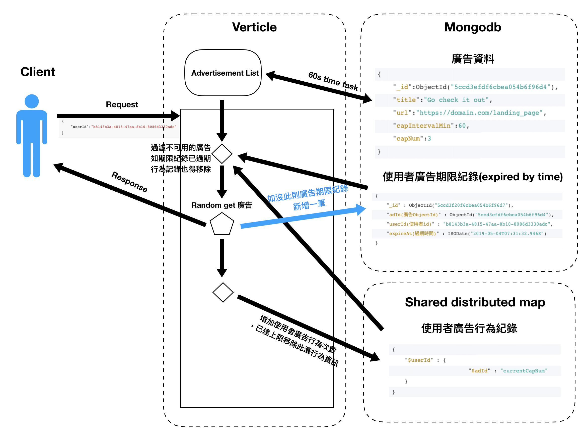

## 架構流程圖


## 業務邏輯實作方式(目前以local Shared Data 方式實作)

> 先將 db 中 10000 筆廣告資料取出暫存記憶體，並設置 [TimeTask 1 分鐘做撈取廣告資料動作]，以減少 db io 存取行為(預設情況為廣告資料非頻繁變動)。

> 當使用者對 API 發出 request 時 ，以使用者 id 至 MongoDB collection userAdLogExp(使用者不可取用廣告紀錄)中[找出目前發出 request 的使用者所有不可取用的廣告紀錄]。

> 使用剛取出不可用紀錄所有廣告 id 做為 filter 條件與暫存在[記憶體的 10000 筆廣告資料做比對]，並從剩餘的資料中亂數取出一筆回應給使用者

> 在回應給使用者前，需取用 local Shared Data 中的使用者廣告行為紀錄判斷是否有超過可使用量，如有已不能使用的廣告，將此筆紀錄寫入 MongoDB collection userAdLogExp(使用者不可取用廣告紀錄)，並將[此筆使用者廣告行為紀錄移除]，以減少 Memory 空間

> local Shared Data 中的使用者廣告行為紀錄為以一個 map 封裝的記錄檔 ，如下所示
```json
{ 
    "$userId(使用者編號)" : {
                        "$adId(廣告編號)" : "currentCapNum(目前廣告使用次數)"
    }
}
```
> 由於 local Shared Data 不可用在 cluster 中，故可改用 redis 或 hazelcast shared distributed map  取代使用者行為紀錄的控管

## MongoDB Schema
廣告資料
```json
{
    "_id":ObjectId("5ccd3efdf6cbea054b6f96d4"),
    "title":"Go check it out",
    "url":"https://domain.com/landing_page",
    "capIntervalMin":60,
    "capNum":3
}
```
使用者不可取用廣告紀錄，[expireAt 欄位需設定 Indexes] ，使 MongoDB 自行判斷過期時間，及 userId 欄位也需設定 Indexes ，增加尋找使用者不可紀錄時效率
```json
{
	"_id" : ObjectId("5ccd3f20f6cbea054b6f96d7"),
	"adId(廣告ObjectId)" : ObjectId("5ccd3efdf6cbea054b6f96d4"),
	"userId(使用者id)" : "b8143b3a-4815-47aa-8b10-8086d3330adc",
	"expireAt(過期時間)" : ISODate("2019-05-04T07:31:32.946Z")
}
```


## 內容物包含
### main.kt
  - 程式進入點 ， deployVerticle
### App.kt & App2.kt
  - 實作 CoroutineVerticle
### KmogoVertxManager.java
  - 管控 Kmogo Client 在 ShareData 中的狀態
### UserAdLogHolder.java
  - 實作 Shareable 使 Verticle local端 共享資源
  
[TimeTask 1 分鐘做撈取廣告資料動作]: <http://daringfireball.net/projects/markdown/>
[expireAt 欄位需設定 Indexes]: <https://github.com/dylan19901222/vertx-kotlin-coroutune-iv/blob/8e4b4bb4e304e0e2182b40c99ffc6ec7d8d21b64/src/main/java/kotlin/frequencycap/App.kt#L192>
[找出目前發出 request 的使用者所有不可取用的廣告紀錄]:<https://github.com/dylan19901222/vertx-kotlin-coroutune-iv/blob/8e4b4bb4e304e0e2182b40c99ffc6ec7d8d21b64/src/main/java/kotlin/frequencycap/App.kt#L108>
[記憶體的 10000 筆廣告資料做比對]:<https://github.com/dylan19901222/vertx-kotlin-coroutune-iv/blob/8e4b4bb4e304e0e2182b40c99ffc6ec7d8d21b64/src/main/java/kotlin/frequencycap/App.kt#L113>
[此筆使用者廣告行為紀錄移除]:<https://github.com/dylan19901222/vertx-kotlin-coroutune-iv/blob/8e4b4bb4e304e0e2182b40c99ffc6ec7d8d21b64/src/main/java/kotlin/frequencycap/App.kt#L135>

