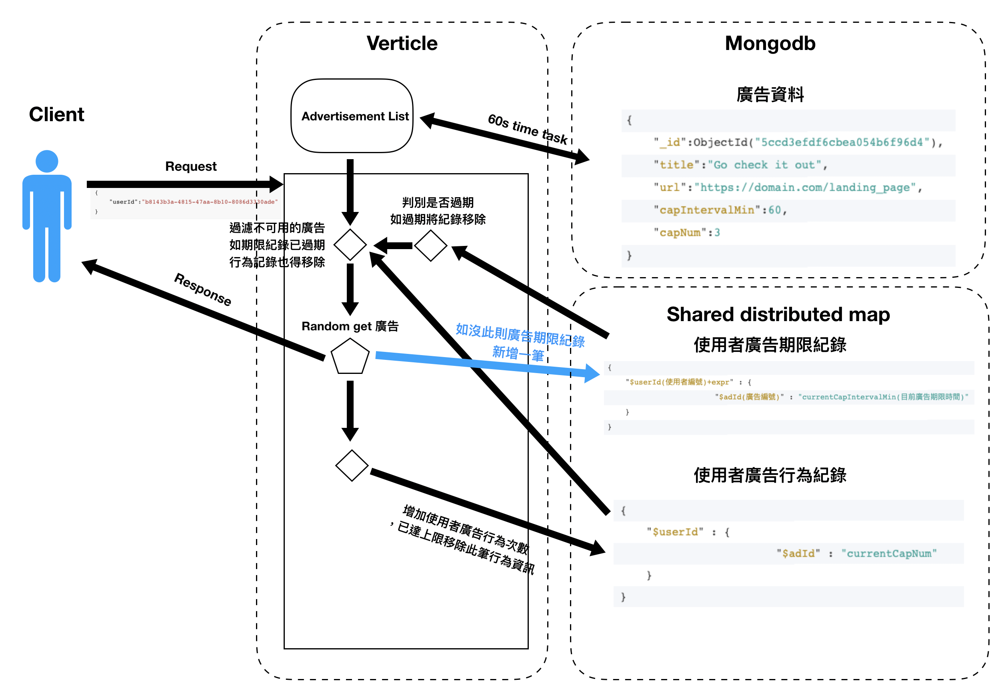

## 架構流程圖
如下，有2份架構流程圖 App 及 AppByMem ，差別在於是否使用 MongoDB 負責控管使用者廣告期限紀錄

App


AppByMem(未實作完成)


## 業務邏輯實作方式(目前以local Shared Data 方式實作)

> 先將 db 中 10000 筆廣告資料取出暫存記憶體，並設置 TimeTask 1 分鐘做撈取廣告資料動作，以減少 db io 存取行為(預設情況為廣告資料非頻繁變動)。

> 當使用者對 API 發出 request 時 ，以使用者 id 至 MongoDB collection userAdLogExp(使用者廣告期限紀錄)中找出目前發出 request 的使用者所有廣告期限紀錄，並與存在 SharedData 中的使用者廣告行為記錄做比對，查看是否有已過期的廣告期限紀錄而使用者廣告行為記錄卻還存在，如存在，需移除使其重新計算(在 AppInMem 架構裡因採用把使用者廣告期限紀錄存在 SharedData 故需自行判斷是否有過期的的紀錄並移除)

> 使用剛取出不可用紀錄所有廣告 id 做為 filter 條件與暫存在記憶體的 10000 筆廣告資料做比對，會以3種狀況的條件做為廣告過濾條件的依據，並從剩餘的資料中亂數取出一筆回應給使用者
1.如此廣告不在使用者廣告期限紀錄 ， 也不在使用者廣告行為記錄，表示該廣告可以用[x,x -> o]
2.如此廣告在使用者廣告期限紀錄 ， 也在使用者廣告行為記錄，表示該廣告可以用[o,o -> x]
3.如此廣告不在使用者廣告期限紀錄 ， 但在使用者廣告行為記錄，表示該廣告不可以用[x,o -> o]
會有這些條件是因為使用者廣告行為記錄超過該廣告使用次數會被移除(減少記憶體空間)，但使用者廣告期限紀錄並還沒到時間，故會出現3種狀況，至於[o,x -> ?]這種條件已在上一個步驟過濾掉了


> 在回應給使用者前，需取用 local Shared Data 中的使用者廣告行為紀錄判斷是否有超過可使用量，並將此筆使用者廣告行為紀錄移除，
> 至於使用者廣告期限紀錄需判斷是否有已有此筆廣告的廣告期限紀錄，如有，將此筆紀錄寫入

> local Shared Data 中的使用者廣告行為紀錄為以一個 map 封裝的記錄檔 ，如下所示
```json
{ 
    "$userId(使用者編號)" : {
                        "$adId(廣告編號)" : "currentCapNum(目前廣告使用次數)"
    }
}
```
> 如下為 AppInMem 架構中的使用者廣告期限紀錄格式

```json
{ 
    "$userId(使用者編號)+expr" : {
                        "$adId(廣告編號)" : "currentCapIntervalMin(目前廣告期限時間)"
    }
}
```

> 由於 local Shared Data 不可用在 cluster 中，故可改用 redis 或 hazelcast shared distributed map  取代使用者廣告行為紀錄及使用者廣告期限紀錄的控管

## MongoDB Schema
廣告資料
```json
{
    "_id":"ObjectId(5ccd3efdf6cbea054b6f96d4)",
    "title":"Go check it out",
    "url":"https://domain.com/landing_page",
    "capIntervalMin":60,
    "capNum":3
}
```
使用者廣告期限紀錄 ，[expireAt 欄位需設定 Indexes] ，使 MongoDB 自行判斷過期時間，及 userId 欄位也需設定 Indexes ，增加尋找使用者不可紀錄時效率
```json
{
  "_id" : "ObjectId(5ccd3f20f6cbea054b6f96d7)",
  "adId(廣告ObjectId)" : "ObjectId(5ccd3efdf6cbea054b6f96d4)",
  "userId(使用者id)" : "b8143b3a-4815-47aa-8b10-8086d3330adc",
  "expireAt(過期時間)" : "ISODate(2019-05-04T07:31:32.946Z)"
}
```


## 內容物包含
### main.kt
  - 程式進入點 ， deployVerticle
### App.kt
  - 實作 CoroutineVerticle ， 僅使用 MongoDB 方式
### AppInMem.kt(未完成品)
  - 以 shardData 控管使用者廣告期限紀錄，沒意外的話，其效率較 App.kt 優秀
### KmogoVertxManager.java
  - 管控 Kmogo Client 在 ShareData 中的狀態
### UserAdLogHolder.java
  - 實作 Shareable 使 Verticle local端 共享資源
  


